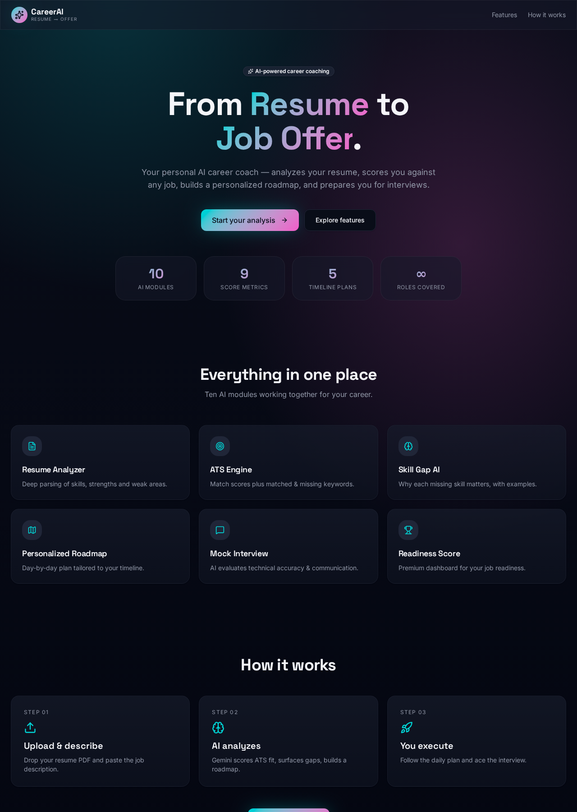
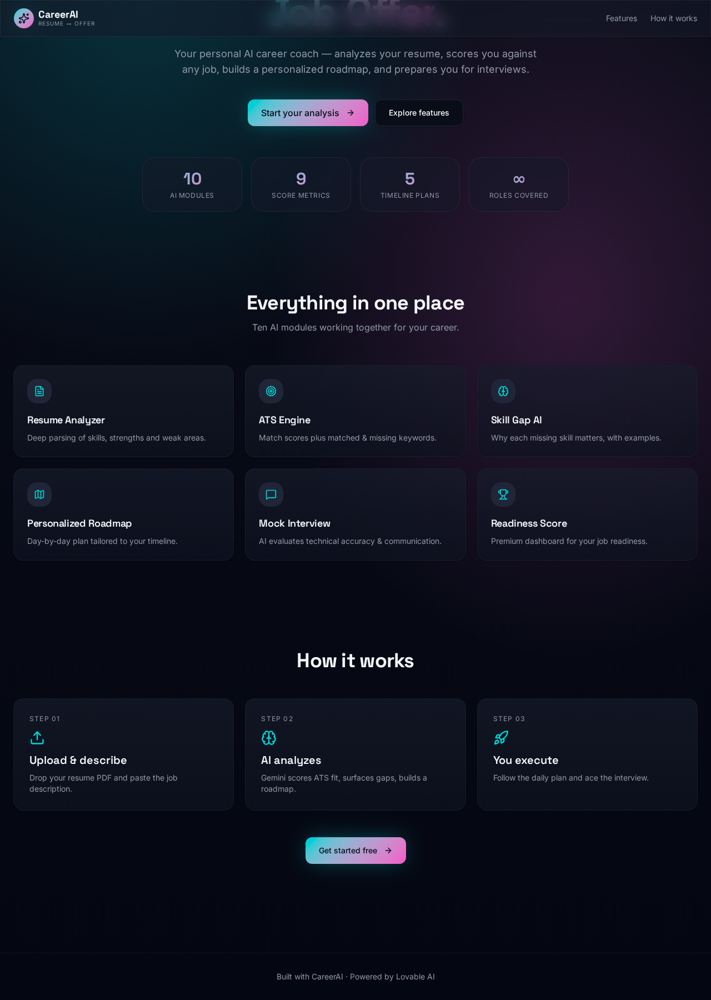

# CareerAI 🚀
### AI-Powered Career Coach for Resume Analysis, ATS Optimization & Interview Preparation

CareerAI is an AI-powered career coaching platform that transforms a resume and job description into a complete job preparation plan. It analyzes resume quality, measures ATS compatibility, identifies skill gaps, optimizes resume content, generates a personalized learning roadmap, prepares interview questions, and evaluates mock interview responses using Google's Gemini AI.

Designed as an end-to-end career assistant, CareerAI helps bridge the gap between **"I found a job posting"** and **"I'm ready for the interview."**

---

## 📸 Preview

### Home



### AI Analysis Dashboard



### Interview & Roadmap


---

# ✨ Features

CareerAI combines multiple AI-powered modules into a single workflow.

- 📄 **Resume Analyzer**
  - Extracts skills, experience, education, strengths, and improvement areas from PDF resumes.

- 🎯 **Job Description Analyzer**
  - Identifies required skills, technologies, keywords, responsibilities, and interview topics.

- 📈 **ATS Compatibility Engine**
  - Calculates ATS score, keyword coverage, skill matching, and missing requirements.

- 🧠 **Skill Gap Analysis**
  - Explains why each missing skill matters, where it is used, how to learn it, and how to present it on a resume.

- ✍️ **Resume Optimizer**
  - Generates ATS-friendly improvements, stronger bullet points, keyword recommendations, and profile enhancements.

- 🗓 **Personalized Learning Roadmap**
  - Creates structured learning plans ranging from one week to three months.

- 💼 **Interview Preparation**
  - Generates technical, HR, resume-based, project-based, and role-specific interview questions.

- 🎤 **AI Mock Interview**
  - Evaluates candidate responses for technical accuracy, communication quality, completeness, and provides ideal answers.

- 📊 **Career Readiness Dashboard**
  - Summarizes ATS score, interview readiness, resume quality, and overall preparation.

- 📚 **Learning Resources**
  - Recommends curated documentation, free courses, YouTube channels, and project ideas.

---

# 🏗 Architecture

```text
                Resume PDF
                     +
            Job Description
                     │
                     ▼
         Client-side PDF Extraction
                     │
                     ▼
              Gemini AI Analysis
                     │
                     ▼
        Structured JSON Response
                     │
     ┌───────────────┼────────────────┐
     │               │                │
 ATS Analysis   Skill Gap AI   Resume Optimizer
     │               │                │
     ├───────────────┼────────────────┤
     ▼               ▼                ▼
 Learning Roadmap   Interview Prep   Mock Interview
                     │
                     ▼
          Career Readiness Dashboard
```

---

# ⚙️ Tech Stack

| Category | Technology |
|-----------|------------|
| Frontend | React 19, TanStack Start, Vite 7 |
| Language | TypeScript |
| Styling | Tailwind CSS v4 |
| AI | Google Gemini 3 Flash |
| Validation | Zod |
| PDF Processing | pdfjs-dist |
| Runtime | Bun |
| Deployment | Lovable Cloud |

---

# 🛠 Engineering Highlights

- Client-side PDF parsing using **pdfjs-dist**
- Type-safe architecture with **TypeScript**
- Structured AI responses validated using **Zod**
- AI orchestration through server functions
- Modular component architecture
- Responsive UI with modern design system
- Stateless architecture without database dependency

---

# 🚀 Getting Started

## Clone the repository

```bash
git clone https://github.com/Param-Pandya/CareerAi.git
```

```bash
cd CareerAi
```

## Install dependencies

```bash
bun install
```

## Run locally

```bash
bun run dev
```

The application runs on:

```
http://localhost:8080
```

---

# 📁 Project Structure

```text
src/
│
├── routes/
│   ├── __root.tsx
│   └── index.tsx
│
├── lib/
│   ├── ai.functions.ts
│   ├── ai-gateway.server.ts
│   └── pdf-extract.ts
│
└── styles.css
```

---

# 🎯 Future Improvements

- Voice-based AI mock interviews
- Cover letter generation
- Resume version comparison
- Authentication & user profiles
- Interview analytics dashboard
- Multi-language support

---

# 📌 Project Goals

CareerAI is designed to demonstrate practical applications of Large Language Models in career development by combining document understanding, structured AI outputs, resume optimization, personalized planning, and interview evaluation into a single intelligent workflow.

---

# 👨‍💻 Author

**Param Pandya**

AI/ML Engineer focused on Machine Learning, Generative AI, LLMs, NLP, and Intelligent Software Systems.

GitHub: https://github.com/Param-Pandya

---

# 🙏 Acknowledgements

Built using **React**, **TypeScript**, **TanStack Start**, **Tailwind CSS**, **Google Gemini AI**, and the **Lovable AI Gateway**.
